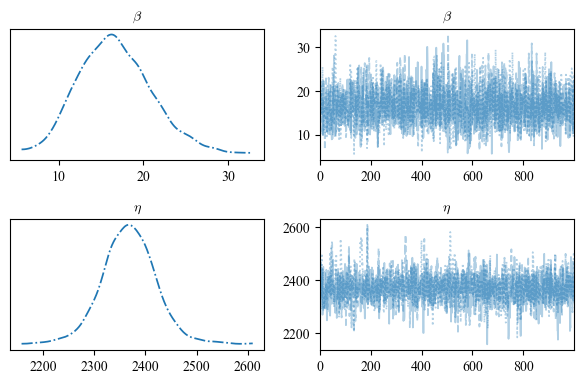
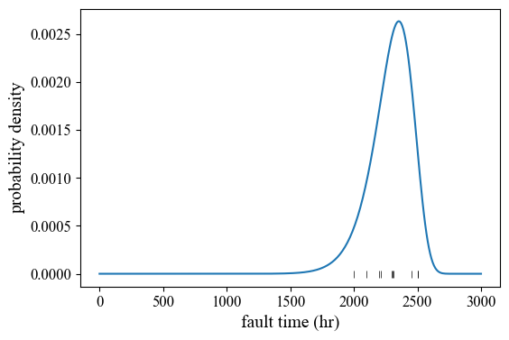

### 基于Weibull分布的可靠性分析介绍

**2023.08.12**

#### 一、Weibull分布介绍

在对设备器件故障进行分析时，如果能够找到故障的规律并将其用数学模型表述出来，有便于人们对设备器件运行的健康状态变化趋势进行判断，这样的过程称为可靠性分析。基于Poisson过程、Weibull分布等的统计模型在可靠性分析中占有重要地位。本文档将对基于Weibull的可靠性分析原理和计算过程进行简单介绍。

Weibull分布可分为两参数和三参数两类：

双参数：

$$
p(t) = \frac{\beta}{\eta} \left(\frac{t}{\eta}\right) ^ {\beta - 1} \exp\left[-\left(\frac{t}{\eta}\right)^{\beta}\right] \tag{1}
$$

三参数：

$$
p(t) = \frac{\beta}{\eta} \left(\frac{t - \gamma}{\eta}\right) ^ {\beta - 1} \exp\left[-\left(\frac{t - \gamma}{\eta}\right)^{\beta}\right] \tag{2}
$$

其中，$p(t)$ 表示故障失效在时刻$t$发生的概率密度, $p(t) \geq 0$，$t \geq \gamma$；$\beta$ 和 $\eta$ 分别为形状参数和尺度参数；$\gamma$ 为位置参数。各参数取值范围如下：

$$
\beta > 0
$$

$$
\eta > 0
$$

$$
-\infty < \gamma < +\infty
$$

当式(2)三参数Weibull分布式中参数 $\gamma = 0$ 时，即对应式(1)中的两参数Weill分布。

通过调整Weibull分布的形状参数β，可以对许多不同寿命分布的特征建模：
1. $0 < \beta < 1$：对应于设备器件的早期失效期，初始失效率很高，并随时间的推移逐渐降低；
2. $\beta = 1$：随机失效期，失效率保持恒定；
3. $\beta = 1.5$：早期磨损失效期，失效率随时间不断增加且最初增加速度最快；
4. $\beta = 2$：磨损失效期，失效率随时间线性增加；
5. $3 \leq \beta \leq 4$：快速磨损失效期，失效率线性随时间快速增加；
6. $\beta > 10$：产品寿命的最后阶段。

通过故障数据拟合所得的Weibull分布，可计算如下可靠性指标（定义和推导过程略）：

1. 平均失效前时间 (Mean Time to Failure, MTTF)：
   $$
   MTTF = \gamma + \eta \cdot \Gamma(1 + \frac{1}{\beta}) \tag{3}
   $$

2. 可靠度 (Reliability)：
   $$
   R(t) = \exp\left[-\left(\frac{t - \gamma}{\eta}\right)^{\beta}\right] \tag{4}
   $$

3. 瞬时故障率 (Failure Rate)：
   $$
   \lambda = \frac{\beta}{\eta} \left(\frac{t - \gamma}{\eta}\right)^{\beta - 1} \tag{5}
   $$

4. 双参数Weibull分布的累计分布函数 (Cumulative Distribution Function)：
   $$
   F(t) = 1 - \exp\left[-\left(\frac{t}{\eta}\right)^{\beta}\right] \tag{6}
   $$

#### 二、基于失效数据和两参数Weibull分布的参数估计和可靠性分析

##### 2.1 基于最小二乘拟合

将式(6)等式两边取自然对数有：

$$
\ln \ln \frac{1}{1 - F(t)} = \beta \ln(t) - \beta \ln(\eta)
$$

令：

$$
\begin{aligned}
    y &= \ln \ln \frac{1}{1 - F(t)} \\
    x & = \ln (t) \\
    b &= - \beta \ln(\eta) \\
    w &= \beta \\
\end{aligned}
$$

则上述分布拟合问题转化为：

$$
y = w \cdot x + b
$$

接下来，便可采用最小二乘拟合获得参数 $\beta$ 和 $\eta$ 及其各自的置信区间。

**注意**：一般人们使用中位秩近似 $F(t)$，该近似可能导致结果出现误差。

##### 2.2 基于贝叶斯参数估计

设经16组独立重复实验后获得某型号器件（不可修复）的失效时间为2000、2100、2200、2215、2300、2305、2315、2456、2500和2500，单位为小时。接下来尝试采用贝叶斯参数估计方法，对符合该失效规律的两参数Weibull分布式进行估计。设式(1)中参数 $\beta$ 和 $\eta$ 的先验均符合均匀分布，其中 $\beta$ 上限为50、$\eta$ 上限为5000，即：

$$
\begin{aligned}
\beta \sim \text{Uniform}(0, 50) \\
\eta \sim \text{Uniform}(0, 5000) \\
\end{aligned}
$$

接下来，将上述16组观测到的失效时间记录代入式(1)，通过贝叶斯参数估计对 $\beta$ 和 $\eta$ 的后验分布进行求解。对两个参数后验分布的蒙特卡洛马尔可夫链（Monte-Carlo Markov Chain, MCMC）采样结果如下：

  

图中，第一列表示两个参数的后验分布，横坐标为参数值，纵坐标为取值的概率密度；右侧为随机采样序列记录，横纵标为采样数，纵坐标为参数值。最终，基于失效时间观测数据获得对两参数的最大后验估计（maximum a posteriori, MAP）结果为：

$$
\beta_{MAP} = 16.88 \\
\eta_{MAP} = 2361.96 \\
$$

可见 $\beta$ 值远高于10，失效时间接近该器件的寿命极限。对应的失效时间概率分布为：

  

其中底部黑色竖线表示所观测到的16组失效时间记录。基于以上结果，可进一步通过式(3)~(5)获得该器件的MTTF、瞬时故障率和可靠度等信息，计算较为简便，此处略。

#### 三、总结

对同一型号的（可修复或不可修复）设备器件在相同环境条件下进行多次**独立**的可靠性实验，便可**基于所得的失效时间记录**对其可靠性和使用寿命进行分析。